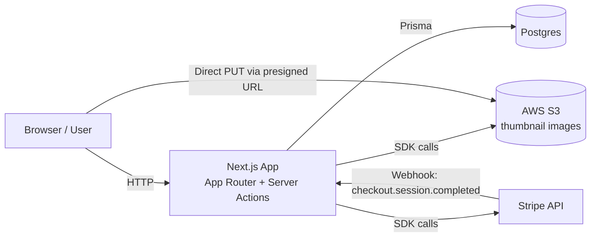
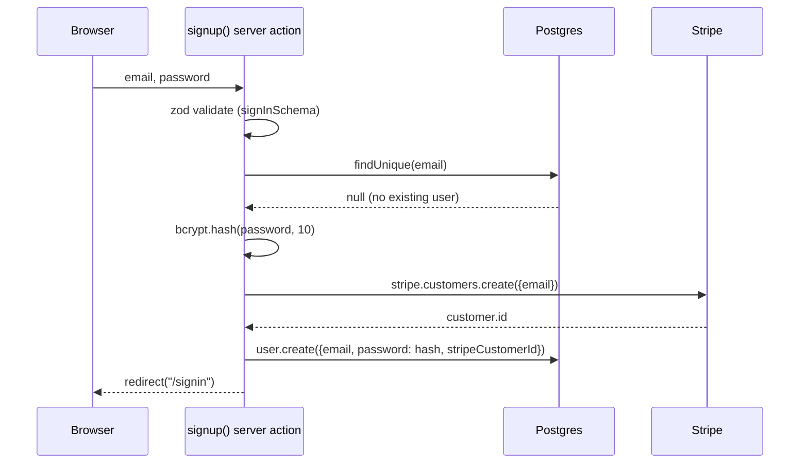
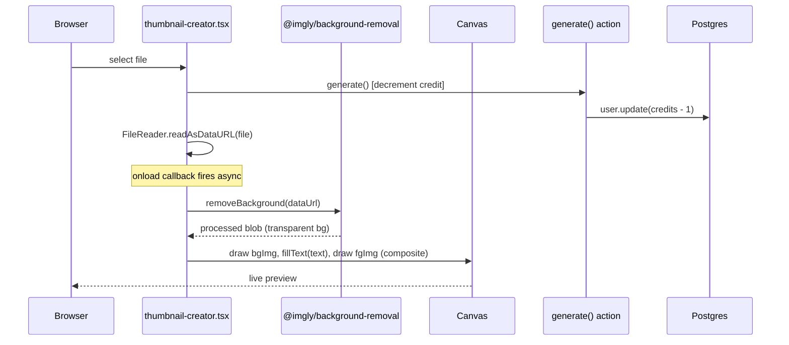
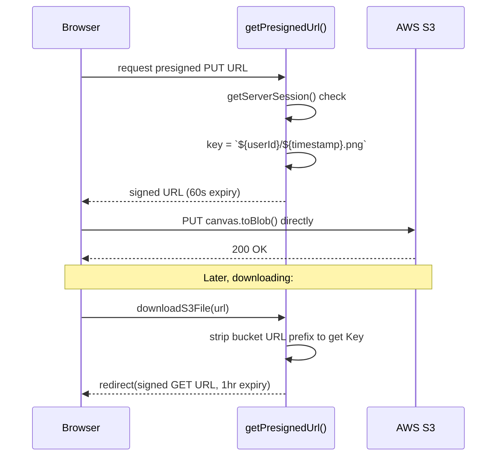
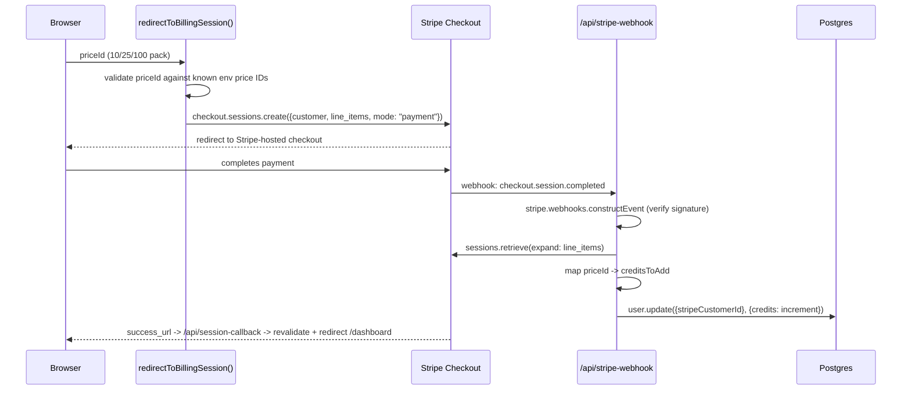

# Thumbnails SaaS — Roadmap, HLD, LLD & Implementation Plan

Based on the `thumbnails-main` repo (T3 stack: Next.js 14 App Router, NextAuth, Prisma/Postgres, AWS S3, Stripe, `@imgly/background-removal`, Canvas compositing).

---

## 1. Roadmap

A phased path through the codebase, ordered the way you'd actually want to build/learn it — foundation → auth → core feature → monetization → polish.

### Phase 0 — Environment & Scaffolding
- Next.js 14 App Router + TypeScript + Tailwind + shadcn/ui (`components.json`, `tailwind.config.ts`)
- T3 env validation (`src/env.js`) — understand why env vars are validated at build time via Zod, not just read from `process.env`
- Prisma set up against Postgres (`prisma/schema.prisma`), `postinstall: prisma generate`

**Goal:** `npm run dev` boots a blank T3 app with a working `.env`.

### Phase 1 — Auth & User Model
- Prisma schema: `User`, `Account`, `Session`, `VerificationToken`, `Post` (NextAuth's standard adapter shape, plus your own `password`, `credits`, `stripeCustomerId` fields bolted onto `User`)
- NextAuth config (`src/server/auth.ts`) with the `Credentials` provider, JWT session strategy, module augmentation for `session.user.id`
- Signup server action (`src/app/actions/auth.ts`): validate → check existing user → bcrypt hash → create Stripe customer → create user → redirect
- `middleware.ts` gating `/dashboard`

**Goal:** a user can sign up, sign in, and hit a protected `/dashboard` route.

### Phase 2 — Core Thumbnail Feature (the actual product)
- Dropzone → `FileReader` → `@imgly/background-removal` → composited `<canvas>` (`thumbnail-creator.tsx`)
- Style presets (`style1/2/3`) and font selection (`next/font` objects resolved to `ctx.font` strings)
- Text-fit-to-width math (measure text, scale font size to 90% canvas width)

**Goal:** upload an image, get a background removed automatically, overlay text, see it live on canvas.

### Phase 3 — Storage (S3)
- Presigned PUT URL generation (`getPresignedUrl` in `aws.ts`), scoped by `userId/timestamp.png`
- Client uploads the canvas blob directly to S3 using the presigned URL (bypasses your server for the actual bytes)
- Presigned GET URL for downloads (`downloadS3File`)
- `Recent` component: server-side `listObjectsV2` scoped to the user's prefix

**Goal:** generated thumbnails persist to S3 and show up in "recent thumbnails."

### Phase 4 — Credits & Monetization
- `credits` field on `User`, decremented in `generate()` server action
- Stripe customer created at signup; checkout session creation (`redirectToBillingSession`)
- Stripe webhook (`/api/stripe-webhook`) — verifies signature, handles `checkout.session.completed`, increments credits by pack size
- `/api/session-callback` — post-checkout redirect that revalidates `/dashboard`
- Dashboard gating: 0 credits → show "buy credits" instead of the creator

**Goal:** a user can run out of credits, buy more via Stripe, and see credits restored.

### Phase 5 — Polish & Deploy
- Landing page, pricing page, toasts (`use-toast`, shadcn `Toast`)
- Error states (upload failures, unauthenticated actions throwing)
- Vercel deployment, production env vars, Stripe webhook endpoint registration

---

## 2. High-Level Design (HLD)

### 2.1 System Context



Key architectural decision: **the browser uploads image bytes directly to S3**, not through the Next.js server. The server's only job is to hand out a short-lived presigned URL. This keeps the Node process from proxying large binary payloads.

### 2.2 Major Components

| Component | Responsibility | Where |
|---|---|---|
| Auth subsystem | Credentials login, JWT sessions, route protection | `server/auth.ts`, `middleware.ts`, `app/actions/auth.ts` |
| Thumbnail Creator (client) | Upload → bg removal → canvas composite → download/upload | `components/thumbnail-creator.tsx`, `dropzone.tsx` |
| Storage layer | Presigned URL issuance, listing recent objects | `app/actions/aws.ts`, `components/recent.tsx` |
| Billing subsystem | Stripe customer, checkout, webhook-driven credit top-ups | `app/actions/stripe.ts`, `api/stripe-webhook/route.ts` |
| Credits gate | Decrement on generate, block dashboard at 0 | `app/actions/generate.ts`, `app/dashboard/page.tsx` |
| Data layer | Prisma models + Postgres | `prisma/schema.prisma`, `server/db.ts` |

### 2.3 Runtime Boundaries

- **Client Components** (`"use client"`): `thumbnail-creator.tsx` — the only place doing heavy client-side work (ML inference for bg removal, Canvas API).
- **Server Components** (`"use server"` at file top, e.g. `recent.tsx`, `dashboard/page.tsx`): fetch session + data, render on the server, no client JS shipped for the data-fetching logic itself.
- **Server Actions** (`"use server"` functions): `auth.ts`, `aws.ts`, `generate.ts`, `stripe.ts` — callable directly from client components as if they were local async functions, but they execute on the server (auth checks, DB writes, secret-key usage all safely server-side).
- **Route Handlers**: `api/stripe-webhook`, `api/session-callback`, `api/auth/[...nextauth]` — used where you need a raw HTTP endpoint (webhooks need to receive Stripe's signature header and raw body; NextAuth needs its own catch-all route).

### 2.4 Cross-Cutting Concerns
- **AuthZ**: every server action that touches user data calls `getServerSession(authOptions)` and derives `userId` from the session — never trusts a client-supplied ID.
- **Env validation**: all secrets (`STRIPE_SECRET_KEY`, `MY_AWS_SECRET_KEY`, etc.) are Zod-validated server-side only (`env.js` `server` block), never exposed to `client`.
- **Idempotency risk**: the Stripe webhook increments credits per event with no idempotency key check — a retried webhook delivery could double-credit a user (flagged in LLD below).

---

## 3. Low-Level Design (LLD)

### 3.1 Data Model (Prisma / Postgres)

```
User
 ├─ id (cuid, PK)
 ├─ email (unique)
 ├─ password (bcrypt hash)
 ├─ credits (Int, default 1)
 ├─ stripeCustomerId (unique, nullable)
 ├─ accounts: Account[]      -- NextAuth OAuth linkage (unused by Credentials but schema-required)
 ├─ sessions: Session[]      -- NextAuth DB sessions (not used; strategy is "jwt")
 └─ posts: Post[]            -- scaffold leftover from create-t3-app, unused by the product

Account, Session, VerificationToken  -- standard NextAuth Prisma adapter tables
Post                                  -- unused scaffold model
```

**Note:** session strategy is `"jwt"`, so the `Session` table is dead weight at runtime — NextAuth won't write to it under Credentials + JWT. The `PrismaAdapter` is still wired up (mainly relevant if you later add OAuth providers, which *do* need adapter-persisted accounts).

### 3.2 Auth Flow (Sequence)



Sign-in afterward goes through NextAuth's `Credentials.authorize` → `bcrypt.compare` → JWT issued with `token.id = user.id` (via the `jwt` callback) → exposed on `session.user.id` (via the `session` callback).

### 3.3 Thumbnail Generation Flow (Sequence)



**Flagged issue (matches your earlier tracked notes):** `generate()` is fired *after* `reader.readAsDataURL(file)` is called but the surrounding function is `async` and awaited — worth re-checking that `await generate()` doesn't race the `onload` callback, since `onload` itself isn't awaited by the outer function. In the current code, credit decrement happens independent of whether background removal actually succeeds — a failed `removeBackground` call still costs the user a credit.

### 3.4 Upload/Download Flow (Sequence)



Object key convention `userId/timestamp.png` is what makes `Recent`'s `listObjectsV2({ Prefix: userId/ })` work as a per-user "folder."

### 3.5 Billing Flow (Sequence)



### 3.6 Component Tree (Dashboard)

```
dashboard/page.tsx (server)
├─ credits === 0 branch
│   └─ Recent (server)
│       └─ DownloadRecentThumbnail (client, per item)
└─ credits > 0 branch
    └─ ThumbnailCreator (client)
        ├─ Style x3 (template picker, pre-upload state)
        ├─ Dropzone (file input)
        ├─ <canvas> (composite target)
        ├─ shadcn Card/Input/Select (text + font controls)
        └─ Recent (server, passed as children)
```

### 3.7 State Machine — `ThumbnailCreator`

Current state is 6 separate `useState` calls: `selectedStyle`, `loading`, `imageSrc`, `processedImageSrc`, `canvasReady`, `text`, `font`. The functional states are really:

```
idle (no imageSrc)
  → loading (file selected, bg removal in flight)
    → ready (imageSrc + processedImageSrc + canvasReady all set)
```

A `useReducer` consolidating `loading/imageSrc/processedImageSrc/canvasReady` into one `status: "idle" | "loading" | "ready"` plus payload would remove the possibility of impossible combinations (e.g. `canvasReady: true` while `processedImageSrc: null`), consistent with the pattern already flagged as worth adopting.

### 3.8 Known Risk Points (LLD-level)

| Area | Risk | File |
|---|---|---|
| Webhook idempotency | No check for already-processed `event.id` — retried Stripe webhook deliveries double-credit | `api/stripe-webhook/route.ts` |
| Credit deduction vs. success | Credit decremented on upload start, not on successful generation | `thumbnail-creator.tsx`, `actions/generate.ts` |
| `document.fonts.ready` | `ctx.fillText` may run before custom fonts (`inter`, `domine`) are fully loaded, causing a fallback-font flash/measurement mismatch | `thumbnail-creator.tsx` |
| Auth on `Recent` | `serverSession?.user.id` used unguarded — if session is somehow null, `prefix` becomes `"undefined/"`, silently listing nothing rather than erroring | `recent.tsx` |
| `NEXTAUTH_SECRET` optional in dev | Fine for local, but a reminder to enforce it strictly in prod (already zod-enforced via `NODE_ENV === "production"` conditional) | `env.js` |

---

## 4. Implementation Plan (Step-by-Step)

Use this as your actual build order if you're following along and want working checkpoints at each step.

- [ ] **Step 1 — Scaffold**
  - `npx create-t3-app@latest` equivalent config (Next.js 14, TS, Tailwind, Prisma, NextAuth, App Router)
  - Add shadcn/ui, install `components.json` setup
  - Get `.env` populated from `.env.example`, confirm `npm run dev` boots

- [ ] **Step 2 — Database & Auth schema**
  - Write `prisma/schema.prisma` (User/Account/Session/VerificationToken + your `password`/`credits`/`stripeCustomerId` additions)
  - `npm run db:push` against a real Postgres (local or hosted)
  - Wire `src/server/db.ts` Prisma client singleton

- [ ] **Step 3 — Auth**
  - `signInSchema` in `schemas/auth.ts`
  - `authOptions` in `server/auth.ts` with Credentials provider + JWT callbacks
  - `signup` server action with bcrypt + Stripe customer creation
  - Sign-in/sign-up pages + forms (react-hook-form + zod resolver)
  - `middleware.ts` protecting `/dashboard`
  - **Checkpoint:** create an account, log in, get redirected from `/dashboard` when logged out

- [ ] **Step 4 — Thumbnail creator UI (no persistence yet)**
  - `Dropzone` component
  - `ThumbnailCreator` state + `FileReader` → `removeBackground` → canvas draw pipeline
  - Style presets + font selection + text-fit sizing math
  - **Checkpoint:** upload an image, see composited thumbnail on canvas, no backend involved yet

- [ ] **Step 5 — S3 integration**
  - S3 bucket + IAM user with scoped PUT/GET permissions
  - `getPresignedUrl` / `downloadS3File` server actions
  - Wire `handleDownload` in `ThumbnailCreator` to upload the canvas blob
  - `Recent` + `DownloadRecentThumbnail` components
  - **Checkpoint:** generated thumbnails appear in S3 and in "Recent thumbnails"

- [ ] **Step 6 — Credits**
  - `credits` decrement in `generate()` action, called on file select
  - Dashboard branch: `credits === 0` → paywall view instead of creator
  - **Checkpoint:** set a test user's credits to 0 in Prisma Studio, confirm paywall shows

- [ ] **Step 7 — Stripe**
  - Create Products/Prices in Stripe dashboard (10/25/100 packs), put price IDs in env
  - `redirectToBillingSession` action + pricing page + `PricingCard`
  - `/api/stripe-webhook` route, verify signature, handle `checkout.session.completed`
  - `/api/session-callback` route for post-checkout redirect
  - Local testing via `stripe listen --forward-to localhost:3000/api/stripe-webhook`
  - **Checkpoint:** buy a credit pack in test mode, confirm credits increment and dashboard unlocks

- [ ] **Step 8 — Polish & deploy**
  - Landing page, toasts for error states, loading states
  - Deploy to Vercel, set production env vars
  - Point Stripe webhook at the production URL, switch to live keys when ready

### Suggested order of fixes once the tutorial build is done
1. Add `event.id` idempotency check on the webhook (store processed event IDs, or check `Stripe-Signature` + a dedupe table).
2. Move the credit decrement to *after* successful `removeBackground`/canvas render, or wrap in a try/catch that refunds the credit on failure.
3. `await document.fonts.ready` before the first `ctx.fillText` call in `drawCompositeImage`.
4. Guard `recent.tsx` and other server components against a null session explicitly (redirect or early-return) rather than letting `undefined` flow into the S3 prefix.
